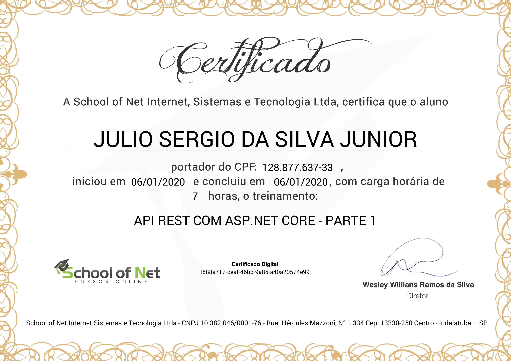

# API Rest com ASP.NET Core - Parte 1
## [School of Net](https://www.schoolofnet.com)

* ASP.NET Core

Instrutor: Victor Lima
"Neste curso você vai ser introduzido ao mundo do desenvolvimento de API Rest com ASP.NET Core, você vai entender o que é REST, e como implementar esta arquitetura no ASP.NET."

